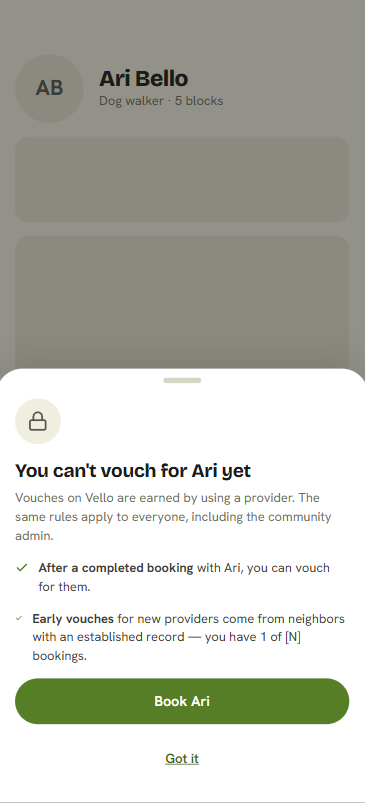
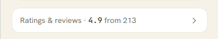
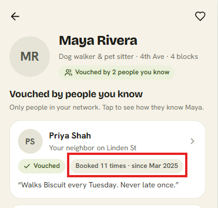
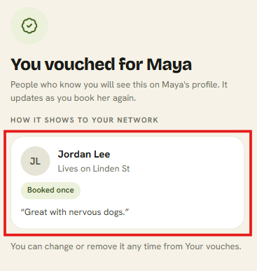

# Practice 5.3: Prototype as a Brief Test

**Incompleteness Score**: 4

**Prototype**: [Vello vouching feature, built by Claude](https://claude.ai/artifact/UdDVoLfERGRK545z5kQVtr?sk=2hoZsgi8Mj-ByiZuxtHN1g)

---

## Instances Where the Prototype Was Forced to Make a UI Decision the Brief Didn't Specify

1. **The "you can't vouch yet" screen.** I can't vouch for this decision yet: where was this rule established? "Established record" is an assumption Claude made on its own. What counts as an "established record," and where was that defined?

   

2. **Ratings and reviews are still shown**, even though I asked for them to be removed completely.

   

3. **A booking count badge is shown**, which I didn't ask for. It could stay, though, since the number of completed jobs is also a trust signal.

   

4. **The "vouched for Maya" screen shows a card I didn't ask for** and whose purpose I don't fully understand.

   

---

## Instances Where the Prototype Made Good Choices

1. A vouch is a separate action you choose to take, not something every booking does automatically.
2. A vouch can only be positive.
3. A vouch stays tied to bookings and keeps updating.
4. An early vouch means "I've used them outside Vello."
5. Vouched providers come first.
6. Vouches are per provider, not per service.
7. Relationship labels come from the network feature. Lines like "Your neighbor on Linden St" and "Lives in your building" assume the separate network feature provides how you know someone.
8. You can message the person who vouched.
9. Vouches can include a comment.
