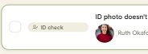
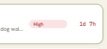
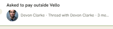
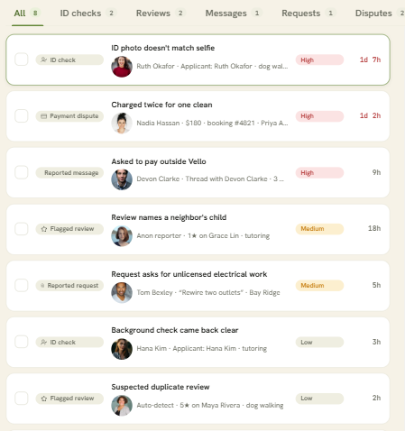
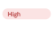
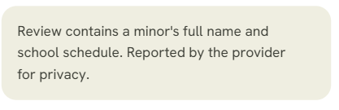
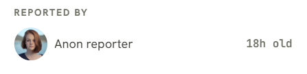
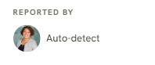

# Vello Moderation Queue: Critique Comparison (Belen vs Claude)

## Objective key

| Code | Objective |
|---|---|
| **U1** | Protect neighborhood safety and trust |
| **U2** | Efficient triage without burnout |
| **U3** | Fair, context-rich decision making |
| **B1** | Zero unverified provider leaks |
| **B2** | SLA compliance and resolution speed |
| **B3** | Accessibility (4.5:1 contrast, 44pt targets) and design-system adherence |

---

## 1. Claude's findings

### 1.1 Visual hierarchy vs user priority

| # | Goal-based question | Evidence | Objective | Slip check |
|---|---|---|---|---|
| H1 | Can an admin tell which ticket to open first? | The list keeps data order. A Medium case (12h) sits below two Lows. There's no sort or filter by severity or age. | B2, U2 | OK |
| H2 | Does the design make approving easier than rejecting? | Approve is a full-width primary button, one tap, no confirmation. Reject is a ghost button and needs a reason. This holds even for "ID photo doesn't match selfie". | B1, U1 | OK |
| H3 | Can a fast double-tap approve the wrong person? | After a resolve, the panel jumps to the first item in the list and Approve stays in place. On mobile the review screen stays open on a different report. | B1 | OK |
| H4 | Can someone bulk-approve high-severity ID checks without noticing? | "Approve selected" accepts any mix of types and severities, with no summary or confirmation. | B1, U1 | OK |
| H6 | Is it clear where a report came from and whose history is shown? | "Reported by" shows the applicant on ID checks. "Account history" doesn't say whose account it is. | U3 | OK |
| H8 | Does the overdue signal match the risk? | The age turns red at 24h whatever the severity. No SLA target is shown. | B2 | OK |

### 1.2 Consistency

| # | Goal-based question | Evidence | Objective | Slip check |
|---|---|---|---|---|
| C3 | Can Low severity be scanned by color like High and Medium? | Low uses the `neutral` badge, the same variant as the case-type badge. | U2 | OK |
| C4 | ~~Is urgency shown in the same color everywhere (coral vs red)?~~ | This assumed the count badge means "urgent". | — | **Taste-based slip** |
| C5b | ~~Should rows use `radius-lg`?~~ | Based only on a code comment, with no goal impact. | — | **Taste-based slip** |

### 1.3 Accessibility

| # | Goal-based question | Evidence | Objective | Slip check |
|---|---|---|---|---|
| A1 | Is "Medium" severity readable? | `amber-700` on `amber-100` is **2.84:1** at 11px. | B3, B2 | OK |
| A2 | Are type badges, "Low" and the tab counts readable? | `ink-500` on `ink-100` is **4.32:1** at 11px. | B3 | OK |

### 1.4 Missing states

| # | Goal-based question | Objective | Slip check |
|---|---|---|---|
| M2 | Can a wrong approval be undone? The toast disappears after 2.4s with no Undo. | B1 | OK |

---

## 2. Belen's findings

### 2.1 What works

| # | Finding | Objective |
|---|---|---|
| W1 | Clear list-based skeleton | U2 |
| W2 | Clear filtering methods | U2 |
| W3 | Good desktop balance: the detail view shares space with the list, giving the admin more control | U2, U3 |
| W4 | The rejection mini screen is great (image) | U3 |
| W5 | Great empty screen showing no matches (image) | U2 |

### 2.2 What doesn't work

| # | Belen's question | Objective | Slip check |
|---|---|---|---|
| D1 | How might we make the case-type badges (ID check, payment dispute, reported message) visible enough that moderators can tell case types apart at a glance and triage faster?   | U2, B1 | OK |
| D2 | How might we help a new admin understand what the screen is for and what to do first, so they can start moderating without training or guesswork? | U2 | OK |
| D3 | How might we raise the contrast of the secondary badges so every moderator, including those with low vision, can read them easily and meet accessibility standards?   | B3 | OK |
| D4 | How might we rewrite the case summary so moderators understand what happened and why it needs review, not just who is involved?   (taste - based) | U3 | **Taste-based slip** |
| D5 | How might we sort the queue by time so older requests don't get buried and every case is resolved within its expected response window?   | B2 | OK |
| D6 | How might we make it clear what High, Medium and Low mean (severity, urgency or risk), so moderators prioritize the right cases first?   | U3, B2 | OK |
| D7 | How might we make this element readable at a glance so moderators don't miss key information while reviewing?   | U2 | OK |
| D8 | How might we word the timestamp so it's clear the report, not the reporter, is 18 hours old, and moderators can judge how urgent a case is without misreading it?   | U3, B2 | OK |
| D9 | How might we signal the Reject action through color and an icon as well as text, so moderators can spot destructive actions and avoid rejecting by mistake?   | B1, B3 | OK |
| D10 | How might we show clearly who made each report (a user, the system or another moderator), with plain labels instead of terms like "autodetect", so moderators can judge how credible the report is?   | U3 | OK |
| D11 | How might we place the search bar under the title so the title can use the full width, making the page easier to scan and giving search a predictable spot? (taste-based) | — | **Taste-based slip** |

---

## 3. Where we agree

| Theme | Belen | Claude | Objective |
|---|---|---|---|
| Case-type badges are hard to tell apart | D1 | C3, A2 | U2, B1 |
| Badge contrast fails AA | D3 | A1, A2 | B3 |
| Queue order buries old or urgent cases | D5 | H1 | B2 |
| Report origin is unclear | D10 | H6 | U3 |
| Button emphasis doesn't match each action's risk | D9 | H2 | B1 |
| The age signal doesn't help judge urgency | D8 | H8 | B2, U3 |
| The no-results empty state works | W5 | Noted as covered | U2 |
| Requiring a reject reason works | W4 | Noted as covered | U3 |
| Search placement is a taste call | D11 | Agreed | — |

## 4. Where we differ

### 4.1 Same area, different conclusion

| Area | Belen | Claude | Why it matters |
|---|---|---|---|
| Filtering | W2: works | H1: type-only filters can't show high-severity or overdue cases | B2 |
| Rejection panel | W4: works | The flow works, but it fails contrast (4.38:1, 4.13:1) and 44pt targets, and it's off-system | B3 |
| Desktop split view | W3: gives control | H3: the same layout auto-advances after a resolve, which makes a double-click misclick possible | U2 vs B1 |
| Sort key | D5: sort by time | H1: sort by severity, then age. Time-only would put a High off-platform-payment case (9h) below a Medium review (18h) | B2, U1 |
| Riskiest misclick | D9: rejecting by mistake | H2: Reject already needs a reason, so it's guarded. Approve is one tap and can leak an unverified provider | B1 |
| Case summary (D4) | Taste-based slip | Goal-based once framed as "why it needs review" | U3 |

### 4.2 Only Belen found

- **D6:** what severity levels mean
- **D8:** "18h old" reads as the reporter's age
- **D2:** first-use orientation (needs evidence)
- **D4:** summary lacks *why*
- **D7:** readability of an element (not named)

### 4.3 Only Claude found

- **H3:** auto-advance after a resolve makes a double-tap misclick possible
- **H4:** bulk approve works across high-severity ID checks without confirmation
- **M2:** no Undo after an approval

## 5. Slip tally

| | Findings | Taste-based slips |
|---|---|---|
| Claude | 12 | 2 (C4, C5b) |
| Belen | 16 | 2 (D4, D11) |

---

## 6. Critique log (agreed items)

| ID | Comment | Objective |
|---|---|---|
| CL-01 | **Case types:** Can moderators tell an ID check from a payment dispute without reading every label? All five types share one neutral badge. | U2, B1 |
| CL-02 | **Badge contrast:** Can low-vision moderators read severity? Medium is 2.84:1 and Low/type is 4.32:1 at 11px, both below 4.5:1. | B3 |
| CL-03 | **Queue order:** Do the oldest and highest-risk cases come up first? The list follows data order, and there's no sort by severity or age. | B2 |
| CL-04 | **Report origin:** Can moderators judge credibility when the source reads "Auto-detect" or "Anon reporter", or shows the applicant under "Reported by"? | U3 |
| CL-05 | **Action risk:** Does the button hierarchy tell moderators which action has the bigger consequence? The decision buttons don't reflect risk. | B1 |
| CL-06 | **Time signal:** Can moderators judge urgency from a case's age? "18h old" beside the reporter's name is ambiguous, and no SLA target is shown. | B2, U3 |
| CL-07 | **Keep:** The no-results state offers one-tap "Clear filters" recovery. | U2 |
| CL-08 | **Keep:** Reject requires a reason before confirming, which supports consistent, recorded calls. | U3 |