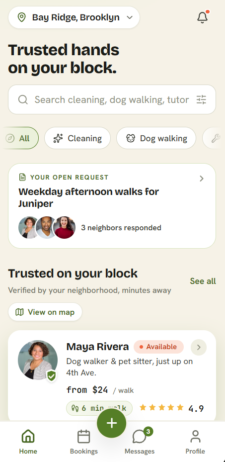

# Practice 4.1: Rank the Hierarchy

**Screen Analyzed**: Vello Mobile App, Home Screen
**Persona Context**: Requester (busy resident looking for trusted local help fast)

---

## 1. Eye-Path Scan (First 3 Elements)

1. **Element 1**: Header Title (*"Trusted hands on your block."*)
   * **Mechanism**: **Scale** (largest text on the screen) + **Weight** (bold, high-contrast black on cream) + **Position** (top of screen, isolated with breathing room around it, nothing competing next to it).
2. **Element 2**: Section Heading (*"Trusted on your block"*)
   * **Mechanism**: **Weight & Contrast** (bold black text, second-largest on the page) standing out against the lighter, smaller text around it (*"Verified by your neighborhood, minutes away"*, *"See all"*).
3. **Element 3**: First Provider Card (*Maya Rivera*)
   * **Mechanism**: **Card size** (large surface area) + **Image placement** (photo in the top-left corner, drawing the eye first) + **Weight** (bold name, clearly contrasted from the lighter description text below it).

*Note: the "Your open request" card sits between elements 1 and 2 on the page, but it doesn't win the eye on first glance. See the critique below.*

---

## 2. Prominence vs. User Goal Comparison

* **User's Primary Goal**: Find a trusted neighbor who is available today for an urgent household task.
* **Current Screen Focus**: The first three things a user sees are, in order: a reassuring headline, a "trusted neighbors" heading, and one neighbor's card. Reading them in sequence does build trust step by step: the headline plants the idea that this app is about trust, the "Trusted on your block" heading tells the requester the app already knows where they live and who's nearby, and the first provider card (photo + name) starts to build familiarity, like the person is already someone they might recognize.

---

## 3. Product Hierarchy Note (Misalignment Found)

* **Where Prominence and User Goal Disagree**: The trust-building path at the top of the screen works well, but two elements that matter just as much for a requester's decision aren't pulled into that same focus:
  * **"Your open request" card**: this tells the requester whether they already have a request in motion (e.g., "3 neighbors responded"), which is highly relevant if they're returning to check status, but it's visually quieter than it should be given how useful it is.
  * **Rating format**: providers are shown with a 5-star rating (*"4.9 ⭐"*), but interviews with Vello users show that a **vouch system** (a neighbor vouching for someone) matters more to trust than a star score. Right now the star rating gets the visual weight that the vouch signal should have.
* **Product Critique**: Elevate the "Your open request" card and the vouch signal so they carry the same visual weight as the trust-building headline. Right now the hierarchy over-invests in general trust messaging and under-invests in the two signals that most directly help a requester decide.
