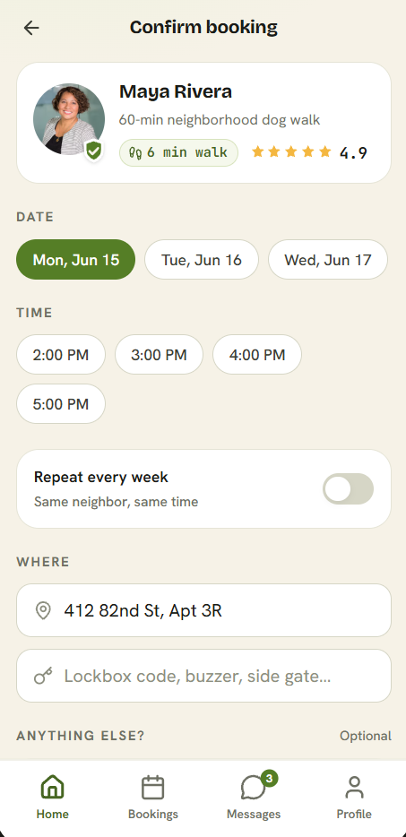
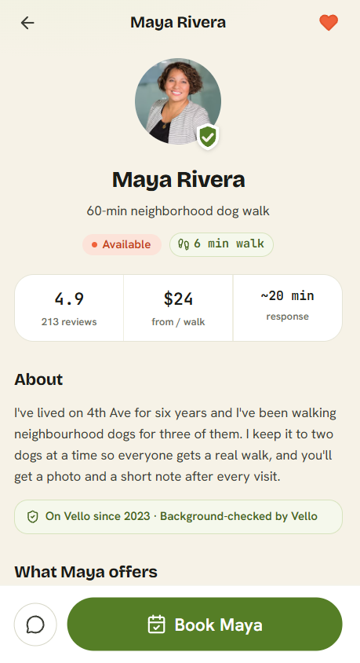
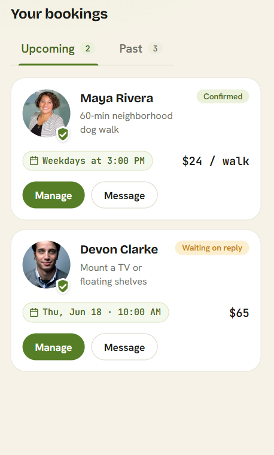
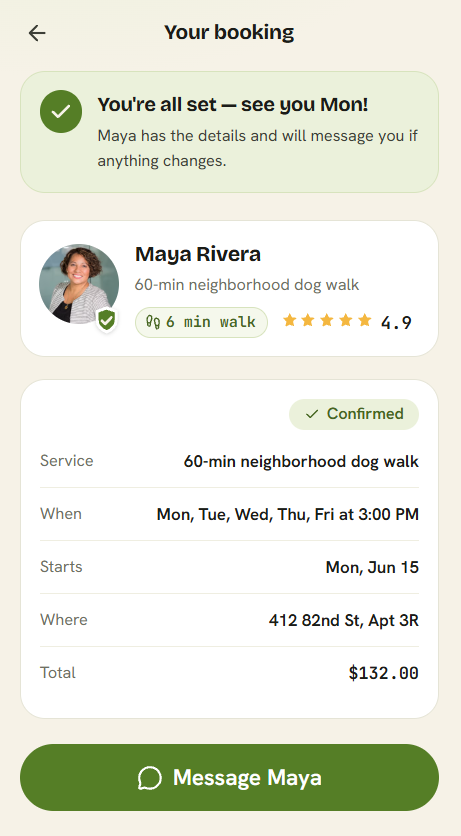
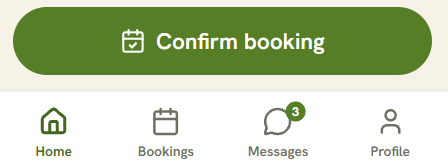
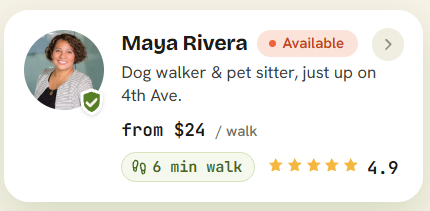

# Practice 4.2: Translate Taste into Goal-Framed Feedback

**Product**: Vello Mobile App

---

## 1. Confirm Booking Screen

<table>
<tr>
<td width="180"></td>
<td>

**Gut Reaction**: In the confirm booking screen, I see too many options at once, and it's confusing if I'm in a hurry. We must change the inputs to something more automatic or fast.

**Rewrite**: When creating a time and schedule before confirming a booking, could we find a way to summarize the form? Or find a way to present it in a simpler way to users?

</td>
</tr>
</table>

---

## 2. Provider Detail View

<table>
<tr>
<td width="180"></td>
<td>

**Gut Reaction**: The detail view of a provider is too plain and full of text. Remove the big paragraphs.

**Rewrite**: Could we find another way to present the user detail information screen in a way that produces more trust and organizes information in an easy-to-digest way?

</td>
</tr>
</table>

---

## 3. Your Bookings Screen

<table>
<tr>
<td width="180"></td>
<td>

**Gut Reaction**: I can almost not see the status on the "Your Bookings" screen for each provider, like "Confirmed" or "Waiting on reply". Could we increase the size of the text?

**Rewrite**: Could we find another way to show the current status of current bookings in a way users can easily comprehend?

</td>
</tr>
</table>

---

## 4. Booking Detail (Already Booked)

<table>
<tr>
<td width="180"></td>
<td>

**Gut Reaction**: When viewing the detail of a booked provider, the text information is too plain. Could we add more icons to it?

**Rewrite**: When presenting the details of a booking already booked, can we find another, more impactful and easy-to-understand organization? In a way that users who cannot read too well can still comprehend the information.

</td>
</tr>
</table>

---

## 5. Tap Bar Overlapping Confirm Button

<table>
<tr>
<td width="180"></td>
<td>

**Gut Reaction**: When clicking on important buttons like Message or Confirm, I accidentally clicked on a tab bar option. Could we remove the tab bar from those screens?

**Rewrite**: About the navigation, could we avoid users accidentally tapping on the wrong buttons?

</td>
</tr>
</table>

---

## 6. Home Provider Card

<table>
<tr>
<td width="180"></td>
<td>

**Gut Reaction**: The card on Home showing "near my block" providers has too many things. Could we remove the price and the walking distance from that card?

**Rewrite**: When presenting information to the user on the home screen, could we avoid saturating users with too much information, and instead show concise information that helps build trust with them?

</td>
</tr>
</table>
