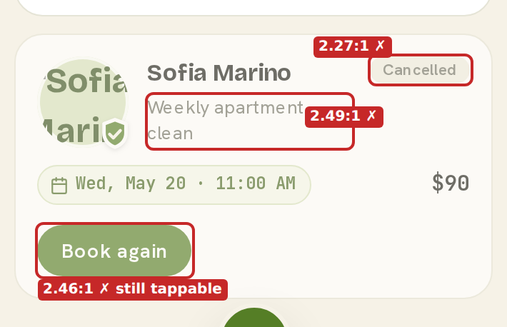
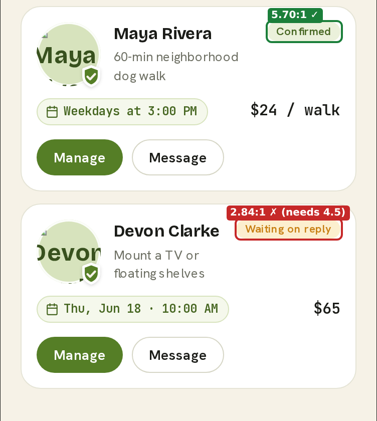
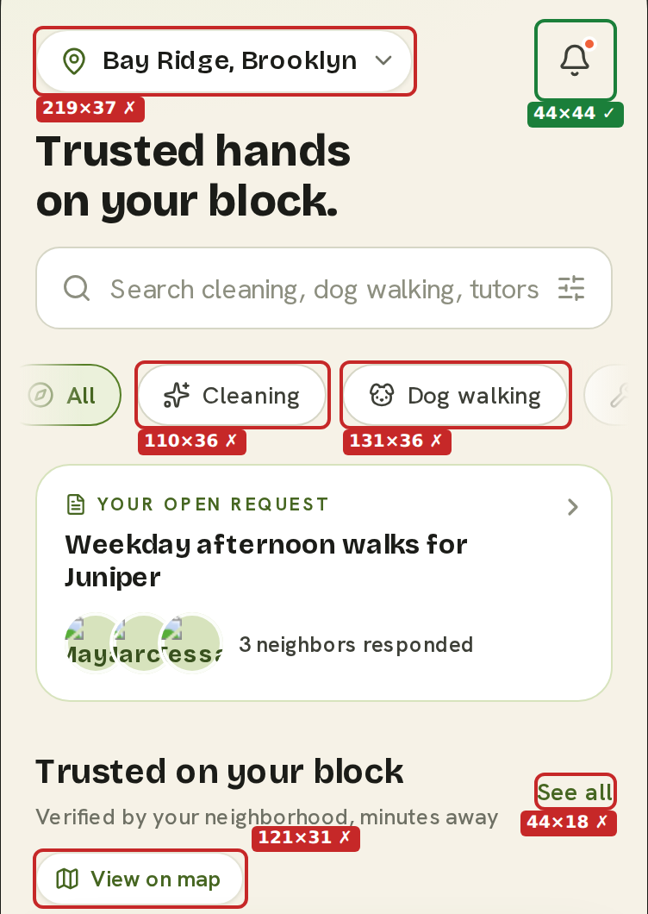
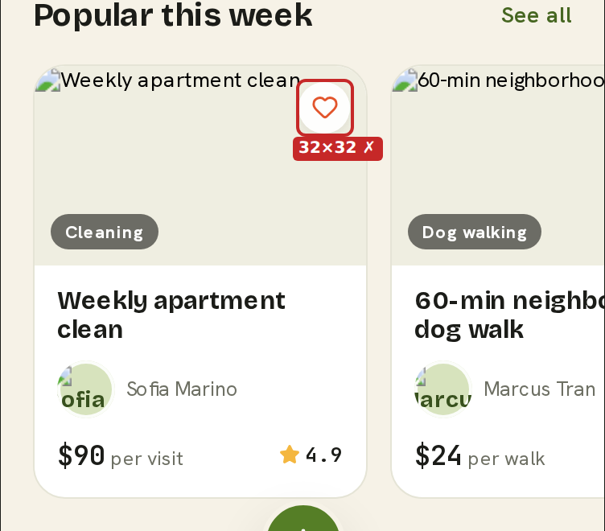
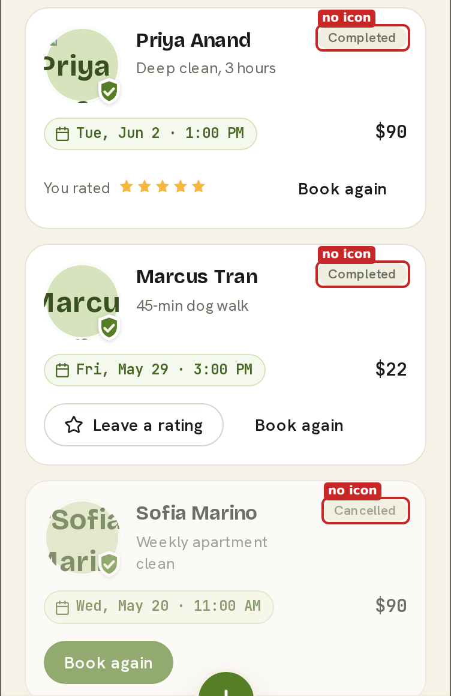

# Vello Accessibility Audit: Top 3 Findings

Sep 24, 2026 · @Belen Camargo

## Summary

Three problems stop Vello from meeting its own accessibility rules: text that is too faint to read, buttons too small to tap, and booking statuses that look the same. Each number below was measured in the rendered prototype, not estimated.

| # | Finding | Worst number | Target | Standard | Where |
| --- | --- | --- | --- | --- | --- |
| 1 | Faint text on booking cards and badges | **2.27:1** contrast | 4.5:1 | WCAG 1.4.3 (AA) | Bookings, Past tab |
| 2 | Tap targets smaller than 44pt | **18pt** tall ("See all") | 44 × 44pt | Vello rule, Apple HIG, WCAG 2.5.5 (AAA) | Home |
| 3 | Booking statuses told apart by color and faded cards, not icons | **0 of 4** statuses have an icon | 4 of 4 | Vello Badge rule | Bookings |

**What was checked:** the Home and Bookings screens of the *Vello prototype* (Design project, 375pt-wide phone frame), and the [Vello Design System](https://vello-design-system.vercel.app/docs/index.html#/overview) pages for Color, Tag, IconButton, Button and Badge.

**How to read the numbers:** contrast is a ratio from 1:1 (invisible) to 21:1 (black on white). Normal text needs at least 4.5:1. At this phone size, 1 CSS pixel equals 1 iOS point (pt).

## Finding 1: Text on booking cards is too faint to read

**Result:** 6 text elements in the prototype fall below the 4.5:1 minimum. The worst is the "Cancelled" label at **2.27:1**, about half the required contrast.

**Why it matters:** people with low vision, older users, and anyone reading in sunlight may not be able to read these words. One of them is a button people still need to tap.

*Bookings → Past. The whole card is set to 62% opacity, which drags every color toward the background.*

*Bookings → Upcoming. "Waiting on reply" uses amber text on an amber tint.*

### The measurements

| Element | Text color | Background | Size | Contrast | Needed | Result |
| --- | --- | --- | --- | --- | --- | --- |
| "Cancelled" badge | #A2A196 (grey at 62%) | #F2F0E3 | 11px | **2.27:1** | 4.5:1 | Fail |
| "Book again" button, cancelled card | #FFFFFF at 62% | #557E26 at 62% | 14px | **2.46:1** | 4.5:1 | Fail |
| Service description, cancelled card | #6E7064 at 62% | #FFFFFF at 62% | 13px | **2.49:1** | 4.5:1 | Fail |
| "Waiting on reply" badge | #C77F12 | #FCEFCF | 11px | **2.84:1** | 4.5:1 | Fail |
| "Available" badge (Home) | #C5421F | #FCE3D9 | 12px | **4.10:1** | 4.5:1 | Fail |
| "Completed" badge | #6E7064 | #EFEEE1 | 11px | **4.32:1** | 4.5:1 | Fail |
| For comparison: "Confirmed" badge | #466621 | #EBF1DB | 11px | 5.70:1 | 4.5:1 | Pass |
| For comparison: headings (Ink on Paper) | #1B1C18 | #F6F2E7 | — | 15.31:1 | 4.5:1 | Pass |

**The design system contradicts itself.** The Badge page says every variant meets 4.5:1 on its tint. The warning variant measures 2.84:1.

**Persimmon (#F0623B) on Paper is 2.88:1.** The prototype does not use it for text today, only for the bell dot and the favorite heart. Keep it that way: it fails even the 3:1 minimum for large text and icons.

### How to fix it

1. Remove the 62% opacity from cancelled cards. Show the cancelled state with the badge and muted text instead: `--text-muted` on white is 5.04:1.
2. Keep "Book again" at full strength: white on olive is 4.77:1.
3. Darken the warning text to about #8A5A0C (5.18:1) and add it to the ramp as `amber-800`.
4. Use Ink-700 #3D3F37 for neutral badge text (9.16:1), and #B23A1B for "Available" (4.87:1).

## Finding 2: Buttons are too small to tap reliably

**Result:** 5 kinds of control on the Home screen are smaller than 44 × 44pt. The worst is "See all" at **18pt tall**, less than half the minimum.

**Why it matters:** small targets cause missed taps, especially for people with tremors, large fingers, or one-handed use. Vello's own principle says "tap targets never below 44px."

*Home. Red outline = the actual tappable area, which is under 44pt. Green = passes.*

*Home → Popular this week. The favorite heart is 32 × 32pt.*

### The measurements

| Control | Tappable area (w × h) | Short by | Result | Cause |
| --- | --- | --- | --- | --- |
| "See all" link (2 on screen) | 44 × **18**pt | 26pt | Fail | Text link with no padding |
| "View on map" | 121 × **31**pt | 13pt | Fail | Small button size used on mobile |
| Favorite heart (4 on screen) | **32 × 32**pt | 12pt | Fail | Custom element, not the IconButton component |
| Category chips (5 on screen) | 70–131 × **36**pt | 8pt | Fail | The Tag component itself is 36pt tall |
| Location selector | 219 × **37**pt | 7pt | Fail | Too little vertical padding |
| Notifications bell | 44 × 44pt | — | Pass |  |
| Bottom navigation tabs | 90 × 50pt | — | Pass |  |
| Create (+) button | 52 × 52pt | — | Pass |  |

**The design system breaks its own rule in two components:**

- **Tag:** renders 36pt tall on its own docs page. Its remove × is 16 × 16pt, though the docs promise "its own 44px target."
- **IconButton, small size:** renders 34 × 34pt. The docs say "the visual circle shrinks; the hit area does not."

**About the standard:** 44 × 44pt is Vello's own rule, Apple's guideline and WCAG 2.5.5 (AAA). The looser WCAG AA rule (2.5.8) asks for only 24 × 24pt or enough spacing, and these controls pass it. So these fail Vello's rule, not WCAG AA.

### How to fix it

1. **Tag:** set a 44pt minimum height, or keep the 36pt look and extend the tap area invisibly by 4pt above and below.
2. **IconButton small:** make the button 44 × 44pt and center the 34pt circle inside it.
3. **Favorite hearts:** replace the custom element with IconButton once step 2 is done.
4. **"See all", "View on map", location selector:** add vertical padding to reach 44pt, or use the medium button size.

## Finding 3: Booking statuses have no icons, and two look the same

**Result:** **0 of 4** booking statuses have an icon or dot. "Completed" and "Cancelled" use the **same colors** (#6E7064 text on #EFEEE1). You can only tell them apart by reading the word or noticing the card is faded.

**Why it matters:** people scan status badges, not read them. Without an icon, someone who is colorblind, or just glancing, can mistake a cancelled booking for a completed one.

*Bookings → Past. Both "Completed" badges and the "Cancelled" badge are the same grey pill.*

### The measurements

| Status | Colors (text / background) | Text label | Icon or dot | Same look as another status? |
| --- | --- | --- | --- | --- |
| Confirmed | #466621 / #EBF1DB (green) | Yes | **No** | No |
| Waiting on reply | #C77F12 / #FCEFCF (amber) | Yes | **No** | No |
| Completed | #6E7064 / #EFEEE1 (grey) | Yes | **No** | **Yes, same as Cancelled** |
| Cancelled | #6E7064 / #EFEEE1 (grey) | Yes | **No** | **Yes, same as Completed** |

All four badges are the same shape (a rounded pill), the same size (11px text, 19pt tall), and have no screen reader label beyond the word itself.

**Against WCAG: pass.** WCAG 1.4.1 (Use of Color) is met because every badge has a text label. Color is not the *only* signal.

**Against Vello's own rule: fail.** The Badge guideline says: pair status color with an icon or dot so meaning is not color-only. None of the booking badges do. The design system's own Badge page breaks this too: its "Pending" and "Cancelled" examples have no icon.

**Mismatch with the system:** the Badge page shows "Cancelled" in red (danger). The prototype uses grey (neutral), which is why it matches "Completed."

### How to fix it

1. Add a Lucide icon to every status: Confirmed `check-circle`, Waiting on reply `clock`, Completed `check`, Cancelled `x-circle`.
2. Use the danger variant for Cancelled: #B23636 on #FBE3E3 is 4.95:1.
3. Use the medium badge size (13px) for booking status, since it is the key fact on each card.
4. Add the missing icons to the Pending and Cancelled examples on the Badge docs page.

## How to check these numbers yourself

Anyone can reproduce every number above with the steps below.

**Contrast.** Each hex color is converted to relative luminance (L), using the WCAG 2.x formula. Then:

$$
\text{Contrast} = \frac{L_{\text{lighter}} + 0.05}{L_{\text{darker}} + 0.05}
$$

For the faded cancelled card, each color was first blended with the Paper background (#F6F2E7) at 62% opacity, which is what the screen actually shows. You can check any pair in the [WebAIM Contrast Checker](https://webaim.org/resources/contrastchecker/).

**Tap targets.** The prototype was opened in a browser at its 375pt phone width. The size of each clickable element was read from the browser (its bounding box), with no zoom or scaling applied, so 1px = 1pt. The screenshots show those exact boxes.

**Status badges.** Each badge's text color, background, font size and child elements (icons, dots) were read from the rendered page on the Upcoming and Past tabs.

**Sources**

- *Vello prototype* (Design project, file "vello-prototype-standalone"), Home and Bookings screens
- [Vello Design System: Overview](https://vello-design-system.vercel.app/docs/index.html#/overview), for the 44px and 14px principles
- [Color](https://vello-design-system.vercel.app/docs/index.html#/color), [Badge](https://vello-design-system.vercel.app/docs/index.html#/badge), [Tag](https://vello-design-system.vercel.app/docs/index.html#/tag), [IconButton](https://vello-design-system.vercel.app/docs/index.html#/icon-button), [Button](https://vello-design-system.vercel.app/docs/index.html#/button)
- [WCAG 2.2](https://www.w3.org/TR/WCAG22/): 1.4.1 Use of Color, 1.4.3 Contrast (Minimum), 2.5.5 Target Size (Enhanced), 2.5.8 Target Size (Minimum)
