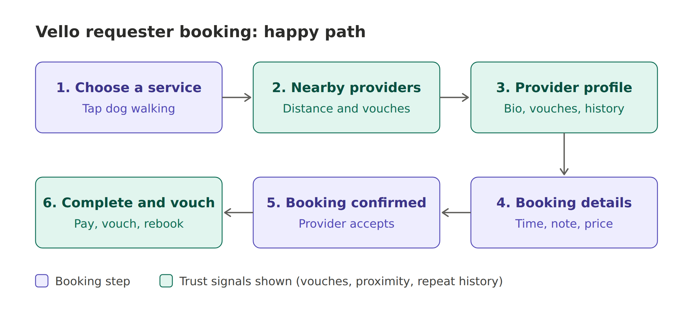
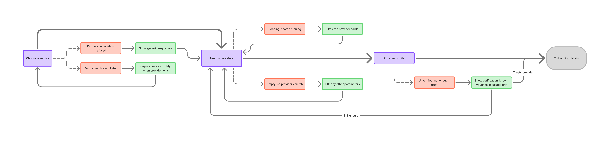

# Practice 3.2: Break a Happy Path

## 1. Initial Happy Path (Claude Draft)

Claude's draft came out as 6 steps. It shows a Requester booking a dog walk where everything goes right.

1. **Choose a service:** The Requester opens Vello and sees their neighborhood ("Maple Heights"). They tap **Dog walking**.
2. **Nearby providers:** A list of local providers, sorted by distance. Each card shows the distance, the neighbor vouches and a "Community Verified" badge. The Requester taps Marco.
3. **Provider profile:** Marco's bio, services and prices, the neighbors who vouched for him, his history in the neighborhood and when he's available. The Requester taps **Book Marco**.
4. **Booking details:** The date and time, duration, a note, a price summary ($18) and a saved payment method. The Requester taps **Confirm booking**.
5. **Booking confirmed:** "You're all set!" Marco has already accepted. The screen shows a summary and a message thread.
6. **Complete and vouch:** Marco marks the walk as done, payment is released automatically, and the Requester is asked to **vouch** and **book again**.

---

## 2. My Edge-Case List (8+ Missing States Found Independently)

1. **Empty State**: 
    * The search returns no results. 
    * The Requester can't find the option they want in step 1 ("Choose a service") and can't pick a service. 
2. **Loading State**: 
    * While the Requester searches for a provider (step 2), and while a booking is being created (step 4 → 5) as the backend runs all the related calls.
3. **Error State**: 
    * The Requester types something wrong in the step 4 booking form, such as a bad date or time, a wrong duration or an unclear description.
4. **Timeout / Non-Response**:
    * The Requester takes too long between filling in the booking details and confirming (step 4).
   * After the booking is confirmed, the Requester writes to Marco and he doesn't reply at all (step 5).
5. **Conflict / Race Condition**: 
    * Provider unavailable. 
    * Two sessions overlap, and another Requester books the provider this Requester was looking at before they confirm.
6. **Cancellation (Pre-Job)**:
   * The Requester regrets it and doesn't want to confirm Marco (step 4).
   * The Requester wants to cancel a confirmed booking because they don't need the service anymore; they found another solution (step 5).
7. **Permission Denied**:
   * Location access, which is needed to search for nearby providers (steps 1–2).
   * Notifications, which are needed for provider messages and upcoming appointments (steps 5–6).
8. **Unverified Provider State**: 
    * The Requester doesn't trust Marco enough to book him (step 3). What would make them trust him? 
    * The profile has to show enough proof: vouches from neighbors they know, verification status and repeat bookings.
    * There also has to be something to do when that proof isn't enough yet.
9. **Price Disagreement / Counter-Offer**: 
    * The Requester doesn't like the price in step 4. How can they propose a different price?
10. **Edit / Reschedule**: 
    * The Requester wants to change a confirmed booking by proposing another time or date (step 5).
11. **Post-Job Dispute & Refund**: 
    * The Requester didn't like the work (step 6). How can they complain? How do they get their money back if the provider didn't do anything, given that payment is released automatically?

---

## 3. Comparison & Brief Checklist (Human vs. AI Delta)

* **What I caught that Claude missed**:
  - **Requester-initiated counter-offer.** Claude only considered the *provider* proposing a different price. I asked how *I* could propose another price.
  - **Second thoughts before confirming.** Claude treated leaving step 4 as "form abandonment,". I framed it as regret, which is a user view that needs a clear, guilt-free way out.
  - **A clear hold / confirm timeout.** Claude flagged the slot race condition and saving drafts, but not a timer on how long a slot is held between the details screen and confirming.
  - **"Not trusted enough" as its own state.** Claude listed mixed signals on a profile. I asked what actually *makes* someone trust Marco, and what they do when the proof isn't enough.
  - **Why people cancel.** "I found another solution" is a reason worth capturing, not just a cancel action.
  - **Form validation errors.** Claude mentioned missing fields but not mistyped or invalid input.
  - **A focused list.** I kept to the states that matter for this flow. Claude listed 100+ items, many of them generic system noise.

* **What Claude caught that I missed**:
  - **Provider-side failures:** the provider declines, suggests a different time or price, cancels at the last minute or doesn't show up. My list only looked at failures from the Requester's side.
  - **Problems during the job:** the provider arrives late, the key is missing or the gate is locked, the job turns out bigger than expected and costs more, or there's a safety incident (the dog gets hurt, something is damaged). I jumped straight from "confirmed" to "complete."
  - **Newcomer / zero-vouch gap:** a Requester with no local network, for whom vouches from strangers mean little, and good new providers with no vouches yet. This matches Themes 1 and 2 of our Kestrel Park research.

* **Key Takeaway for Product Brief**: A brief cannot just specify "a booking screen." It must explicitly define the cancellation policy, timeout rules and empty search states. For Vello specifically, it also needs to cover **both sides of the marketplace** (provider declines, no-shows and changes to the job, not just Requester actions) and **what happens when trust is missing** (a newcomer with no network, a provider with no vouches, a neutral option after a job). Those are the places where a vouch-based model breaks first.

---

## 4. Unhappy Paths (Claude Collab)

