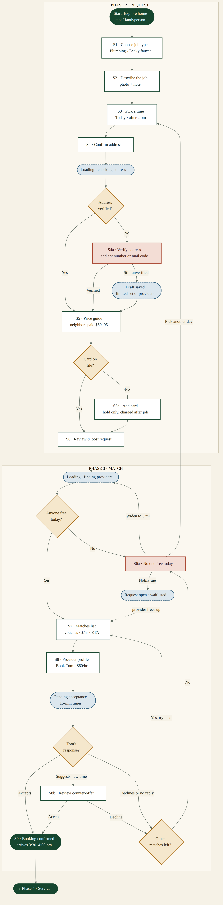
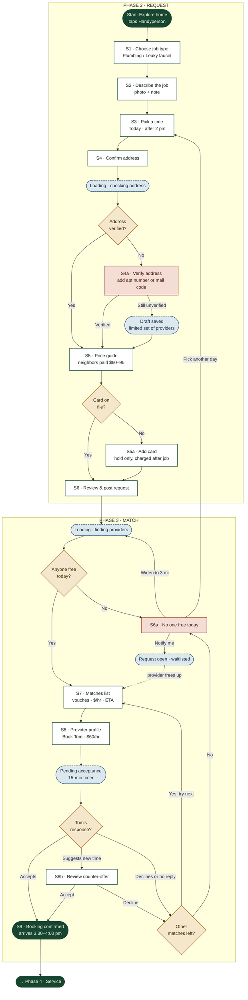

# Micro-practice 3.3: Journey Map vs. User Flow

**User goal**: Get a leaky faucet fixed today (Requester role)
**Who**: Alex, a renter in Bedford-Stuyvesant, Brooklyn. Moved in 8 months ago and knows 3 neighbors.
**Sources**: Vello App UI kit (provider Tom Baptiste, licensed handyperson, 1.6 mi away, $60/hr), the Vello design system, and the Kestrel Park research (people trust neighbor vouches, newcomers lack a local network, everyone worries about fair pricing).
**Artifacts**: [Leaky Faucet Journey](https://claude.ai/artifact/YDNreskCRtcw5roxNx8vVH) (the journey map) · [Request & Match Flow](https://claude.ai/artifact/KkRJgQAY7vy4hSW9vMQp3P) (the user flow)

---

## 1. High-Level Journey Map (Macro Level)

| Phase | User Actions | Mindset & Goals | Emotional State |
| :--- | :--- | :--- | :--- |
| **1. Discovery** | Hears the kitchen tap dripping at 7:40 am and tightens the handle, but it keeps dripping. Texts the landlord and gets no reply. Remembers the Vello flyer in the lobby and looks for someone who can fix it today. | *"I need someone today, and I don't know anyone here to ask."* | Frustrated / Anxious |
| **2. Request** | Takes a photo of the drip. Explains the problem, when they'll be home and where they live. Checks what a fair price looks like, then asks for help. | *"Let me explain this once so nobody wastes my time."* | Cautiously hopeful |
| **3. Match (Decision)** | Weighs who's nearby, affordable and vouched for by neighbors. Chooses Tom, waits to hear back, and learns he'll arrive between 3:30 and 4:00 pm. | *"Who have my neighbors actually used? Will anyone come today?"* | Anxious → Relieved |
| **4. Service** | Knows when Tom is on his way and lets him in. Watches the diagnosis (a worn cartridge), agrees to the extra part before Tom uses it, and checks that the tap is dry. | *"Is this the person I booked, and is the fix what I was quoted?"* | Reassured |
| **5. Payment** | Checks the bill against the quote (45 minutes of labor plus the part), adds a tip and pays. | *"Did I pay a fair price?"* | Watchful → Satisfied |
| **6. Review** | Rates the job, vouches for Tom to others in the building, and keeps Tom's contact for next time. | *"I'd tell the neighbors about him."* | Confident / Belonging |

**Channels by phase**:

1. Discovery: the kitchen sink, a text to the landlord, the lobby flyer, the Vello app
2. Request: the Vello app, the phone camera
3. Match: the Vello app, notifications
4. Service: in person at the door, messages with Tom
5. Payment: the Vello app, a card
6. Review: the Vello app, conversations with neighbors

**Emotion curve**: Low at Discovery, rising through Request. It dips while Alex waits to hear back from a provider, then lifts once the booking is confirmed. It dips again slightly at Payment while Alex checks the price, then peaks at Review.

> **Why a journey map**: It zooms out to the full six-phase arc so the team can see where trust and emotion rise or fall. Screen-level detail would bury that.

---

## 2. Request & Match User Flow (Micro Level)

Covers only phases 2 and 3: Request and Match.

**How to read it**

| Shape | Meaning |
| :--- | :--- |
| White rectangle | Screen the user sees (S1–S9) |
| Amber diamond | Decision branch |
| Blue dashed pill | System state (e.g. `Loading`, `Pending Acceptance`) |
| Red rectangle | Error or recovery screen |
| Dark green pill | Start, end, or hand-off to the next phase |

The main path is straight: **S1 → S2 → S3 → S4 → S5 → S6 → S7 → S8 → S9**. Every branch that leaves this path eventually comes back to it:

* **Address can't be verified** → S4a lets the user fix it. If it still fails, the request is saved as a draft with a limited set of providers.
* **No card on file** → S5a adds one (just a hold) and returns to S6.
* **No providers free today** → S6a offers three options: widen the search to 3 mi, pick another day (back to S3), or join a waitlist.
* **Tom declines, doesn't reply in 15 minutes, or suggests another time** → the user sees the next match (back to S7), or the S6a screen if no matches are left.

Mermaid source (renders in GitHub, Notion, Obsidian)

**System states covered**: `Loading · Checking address`, `Draft saved`, `Card hold pending`, `Loading · Finding providers`, `Request open · waitlisted`, `Live: new matches appear`, `Pending Acceptance · 15 min`, `Confirmed`.

**Open questions for the team**: Should the acceptance window really be 15 minutes? Should the wider search radius really be 3 miles?

> **Why a user flow**: It narrows to one slice of the journey so every screen, branch, and system state is clear enough for design and engineering to actually build and test.

---

## 3. What I Fixed After the First Draft

I asked Claude to check both documents for two things: UI language sneaking into the journey map, and feelings sneaking into the user flow.

* **Journey map described screens instead of people.** It said things like *"Taps 'Leaky faucet' under Plumbing"* or *"Approves the $18 part in-app."* I rewrote these as what a person actually does: *"Explains the problem and when they'll be home"*, *"Weighs who's nearby, affordable, and vouched for by neighbors."*
* **Touchpoint row repeated the user flow.** It listed app screens and components instead of real-world channels. I replaced it with a **Channels** row: the kitchen sink, a text to the landlord, the lobby flyer, the app, Tom at the door, conversations with neighbors.
* **User flow explained feelings, not just steps.** Its footer justified a design choice by how users feel. I cut that line — reasoning about emotion belongs in the journey map, not the flow.
* **One step was out of scope.** *"Adds it to the calendar"* happens after booking, outside Request & Match, so I removed it.
* **Kept the offline moments in the journey map on purpose.** Tightening the handle, texting the landlord, letting Tom in — these give the big picture its human context, even though they never touch the app.